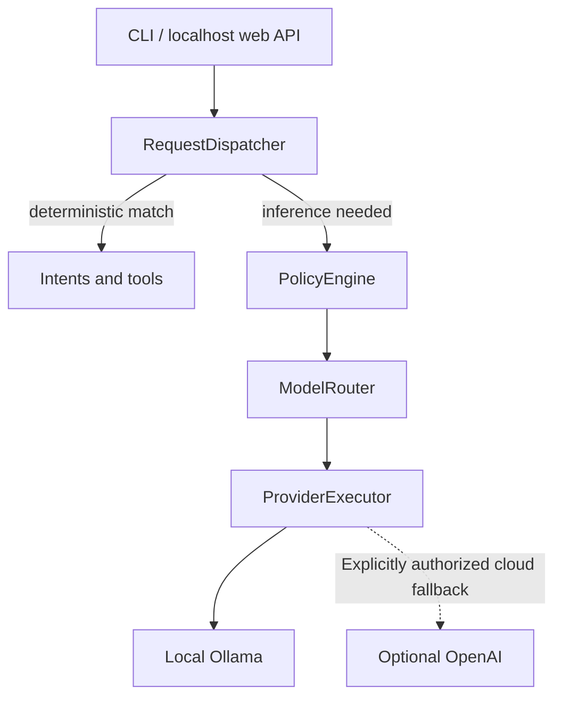

# Porter

[](https://github.com/BrentDean/porter/actions/workflows/ci.yml)

**Porter is a local-first AI and automation control plane that routes natural-language requests through deterministic software before model inference.**

Rather than sending every request to an LLM, Porter separates recognition, authorization, execution, and inference. Known operations use deterministic tools and domain services; requests that require inference can use local Ollama or explicitly authorized cloud providers through policy-controlled routing.

The project is designed as an operational Linux service rather than a chatbot demo. It includes persistent tasks, reminders and timers, SQLite-backed state, background workers, Docker deployment, health/readiness endpoints, Prometheus/Grafana/Alertmanager observability, structured logging, backup/restore, failure-injection testing, and desktop integration.

**Stack:** Python 3.11+ · SQLite · FastAPI · Ollama · PySide6 · Docker/Compose · systemd · Prometheus · Alertmanager · Grafana · pytest · Ruff · GitHub Actions

**New here?** Follow the [five-minute project walkthrough](docs/project-walkthrough.md) for a reproducible demonstration of the request path, desktop timers, monitoring, and recovery.

## See it work

| Try | What happens |
| --- | --- |
| `porter "what is 5+6?"` | A deterministic arithmetic tool answers without calling an LLM (requires `qalc`). |
| `porter "set a timer for 30 seconds"` | Porter persists a timer; its systemd user worker delivers it, and the optional tray shows a live countdown and Porter-owned popup. |
| `porter "explain DNS"` | An unmatched request uses configured local Ollama inference. Cloud access is not silently substituted when local inference is unavailable. |
| `porter reliability --window 24h` | A report derives success rate, latency percentiles, and error-budget status from persisted request telemetry. |

The web interface and monitoring UIs run on **localhost by default**. Porter is a self-hosted project, not a publicly hosted, authenticated SaaS demo.

## Engineering evidence

| Area | Implemented work | Where to inspect it |
| --- | --- | --- |
| **Application architecture** | Separate request dispatch, authorization/policy, provider selection, execution, and persistence. | [Separation of duties](docs/architecture/0001-separation-of-duties.md) · [Request and web API](docs/architecture/web-api.md) |
| **Reliability** | Retry/backoff, atomic reminder claims, stale-claim recovery, provider failure/fallback tests, graceful shutdown, and latency/error-budget reporting. | [Resilience tests](docs/architecture/resilience-testing.md) · [Reliability reporting](docs/architecture/reliability-reporting.md) |
| **Operations** | Health/readiness endpoints, bounded Prometheus metrics, structured JSON logs, Grafana dashboard, alert rules, Alertmanager webhook delivery, and a reproducible outage/recovery drill. | [Monitoring stack](docs/architecture/monitoring-stack.md) · [Structured logging](docs/architecture/structured-logging.md) |
| **Data protection** | Online SQLite snapshots, integrity verification, optional retention, and restore to a *new* database without replacing live state. | [Local data protection](docs/architecture/local-data-protection.md) · [Backup tests](tests/test_backup.py) |
| **Desktop integration** | systemd user worker, KDE/XDG tray autostart, private Unix-socket notifications, and a `notify-send` fallback. | [Service management](docs/architecture/local-service-management.md) · [Desktop notifications](docs/architecture/desktop-notifications.md) |
| **Automated verification** | Python 3.11/3.12 tests, Ruff, a dedicated fault-injection test slice, container and monitoring smoke tests, and publication/secret scans. | [CI](.github/workflows/ci.yml) · [Publication verification](.github/workflows/publication-verification.yml) |

## Request path



The tray and background reminder worker use the same reminder/domain storage without becoming additional inference dispatchers or delivery workers. See [architecture documentation](docs/README.md) for the component boundaries.

## Quick start

From a source checkout (Python 3.11+; on Debian/Ubuntu install `qalc` for arithmetic and `libnotify-bin` for desktop notifications):

```bash
python -m venv .venv
source .venv/bin/activate
python -m pip install -e '.[dev,tray,web]'
porter doctor
porter
```

Example commands:

```bash
porter "what time is it"
porter ask "explain DNS"
porter reliability --window 24h
porter backup create
porter backup list
porter "remind me in 10 minutes to check the build"
porter "remind me in 10 seconds to test the popup"
porter "set a timer for 30 seconds"
porter "show my timers"
porter web
```

For the containerized web runtime:

```bash
cp .env.example .env
docker compose up --build -d
curl --fail http://127.0.0.1:8000/healthz
curl --fail http://127.0.0.1:8000/readyz
```

To add the local monitoring stack, **first set a unique `GRAFANA_ADMIN_PASSWORD` in `.env`** (the example intentionally leaves it blank). The monitoring overlay now refuses to start without one. For example, generate a value with `python3 -c "import secrets; print(secrets.token_urlsafe(24))"` and paste it into `.env`:

```bash
docker compose -f compose.yaml -f compose.monitoring.yaml up --build -d
```

Prometheus is then available on host loopback port `9090`, Alertmanager on `9093`, the local alert receiver on `9087`, and Grafana on `3000`. Run `bash scripts/monitoring-outage-drill.sh` for an isolated stop/detect/restart/resolve demonstration.

## Local-first and safety design

Porter keeps execution authority separate from natural-language recognition and model availability. Deterministic recognition does not itself authorize side effects, and cloud availability does not itself make a request cloud-eligible.

- local-only requests cannot silently escalate to a cloud provider;
- cloud execution requires explicit configuration plus policy eligibility;
- persistent memory is injected only into eligible local inference requests;
- the web runtime defaults to loopback and remains unauthenticated by design;
- the supplied Compose configuration publishes the web port only on host loopback;
- remote/LAN/public exposure is intentionally deferred until an explicit authentication and access-control boundary exists;
- observability is non-authoritative and excludes prompt text, principals, sessions, secrets, exception messages, and tracebacks from Porter-owned structured logs.

## Inference, memory, and caching

Porter treats inference providers as replaceable adapters. Ollama is the local provider and is constrained to loopback configuration. OpenAI is an optional cloud provider that is constructed only when explicitly configured. Cloud eligibility remains subject to Porter's privacy policy and per-request authorization rather than provider availability alone.

When deterministic intents and tools do not match, the CLI and localhost browser automatically use local inference without asking for permission on every turn. For example, `porter "hello"` reaches the configured Ollama model directly. An unavailable or unconfigured local model produces a clear provider error; it does **not** authorize cloud fallback. To explicitly permit cloud fallback for one CLI request, use `porter ask --allow-cloud "explain DNS"` and confirm when prompted. Browser/API requests remain local-only; `allow_inference` approves or declines inference, not cloud access.

Persistent memory is explicit and principal-scoped. Remembered facts retain request/source provenance and may be listed or forgotten deterministically. Relevant stored facts can be injected into local inference context; Porter does not currently inject persistent memory into cloud-eligible requests.

Inference responses may be cached in SQLite using a request/provider/model-aware cache key and bounded TTL. Cache failures are deliberately non-authoritative: Porter degrades to live provider execution rather than failing an otherwise valid request.

## Operational observability and reliability

Porter's runtime lifecycle is observed by independent consumers rather than making telemetry authoritative application state. SQLite telemetry stores request outcomes and latency plus provider/tool attempt timing, usage, cost, and error classification. Prometheus metrics observe the same runtime events with bounded labels. A dedicated structured logger emits request-correlated JSON events without prompt text, principals, sessions, secrets, exception messages, or tracebacks.

The local web process exposes:

- `GET /health` as the compatibility liveness endpoint;
- `GET /healthz` for process liveness;
- `GET /readyz` for required local readiness checks;
- `GET /metrics` for Prometheus exposition.

Optional inference-provider outages do not make the whole Porter process unready when deterministic functionality and required local persistence remain available.

`porter reliability` derives SLO-style reports from persisted terminal request telemetry instead of maintaining a separate reliability database. Reports include request population, success rate, p50/p95 latency, and configurable error-budget consumption over a selected lookback window.

A dedicated `pytest -q -m resilience` slice exercises deterministic failure and recovery scenarios such as provider fallback/exhaustion, cache and telemetry degradation, reminder retry/backoff and stale-claim recovery, and graceful shutdown. These are controlled fault-injection tests, not production chaos experiments.

An optional Compose overlay runs Prometheus, Grafana, and node_exporter. Prometheus scrapes Porter and Linux host metrics, Grafana provisions a repository-managed Porter operations dashboard, and Prometheus evaluates alert rules for application availability, request errors/latency, provider fallbacks, and host CPU/memory/filesystem pressure. Monitoring UIs remain bound to host loopback.

Porter-owned operational logs use one JSON object per line. The canonical human-facing `porter` entry point defaults to `WARNING`, while Compose continues to set `PORTER_LOG_LEVEL=INFO` for the web runtime. `PORTER_LOG_LEVEL` accepts `DEBUG`, `INFO`, `WARNING`, `ERROR`, or `CRITICAL` and overrides the default. Request IDs are included for correlation, while high-cardinality request identifiers remain excluded from Prometheus labels.

## Command-line interface

`porter` is the canonical command-line entry point. Running it with no arguments starts the interactive REPL, and direct natural-language one-shot requests remain supported.

```bash
porter
porter "what time is it"
porter ask "explain DNS"
porter doctor
porter reliability --window 24h
porter backup create
porter backup list
porter backup create --keep 14
porter backup verify /path/to/backup.db
porter backup restore /path/to/backup.db --destination /path/to/new-recovery.db
porter config set ollama.model qwen2.5:7b
porter training
porter training review
porter service
porter service install --enable-now
porter service status
porter tray
porter tray install
porter tray status
porter web
```

`porter-service`, `porter-tray`, and `porter-web` remain available temporarily as compatibility aliases. New documentation and launch configuration should use the `porter <command>` forms.

<details>
<summary>Detailed runtime behavior, architecture boundaries, and persistence semantics</summary>

## Detailed runtime behavior

One-shot reminder intents support bounded relative second/minute/hour durations, 12-hour clock times, optional today/tomorrow qualification, listing scheduled reminders, and cancellation by exact message or reminder ID. Timer intents support starting one timer for 1–100 seconds, minutes or hours, listing active timers with time remaining, and cancellation by name or ID (or with no ID if only one timer is active). Timers share the reminder persistence and delivery state machine rather than running another scheduler. `ReminderRunner.run_once()` first recovers delivery claims older than its bounded claim lease, discovers delivery-ready scheduled reminders across principals, then atomically changes each still-due reminder to `delivering` before invoking the delivery adapter. A stale candidate that was edited, snoozed, or cancelled before the atomic claim is skipped. Once claimed, interactive lifecycle mutations reject the transient `delivering` state rather than overwriting the worker's claim. Expected endpoint failures return the reminder to `scheduled` with durable retry backoff; successful delivery transitions the claim to `delivered`. Unexpected programming or persistence failures propagate. The runner intentionally provides at-least-once rather than exactly-once delivery: a process failure after an external notification succeeds but before finalization may leave a delivery claim that is later recovered and retried. The current claim lease is five minutes, comfortably longer than the desktop notification adapter's bounded execution timeout. `PorterService` repeatedly invokes the runner without overlapping passes, performs an immediate startup pass for overdue reminders, and waits interruptibly between passes. Recurrence remains a separate later layer.

`ReminderService` owns reminder lifecycle transitions. A reminder may be snoozed or rescheduled to a future time when it is scheduled, delivered, or cancelled; rescheduling returns it to `scheduled` and clears delivery/cancellation/retry state. The transient `delivering` state is intentionally protected from edit, snooze, reschedule, cancel, and delete operations. Lifecycle writes include an expected-state guard so a stale UI write cannot overwrite a claim that won the race. Delivered and cancelled reminders may be permanently cleared from history, while scheduled reminders are protected from deletion and must be cancelled first. Bulk history clearing deletes only terminal reminders for the selected principal.

`NotifySendReminderDelivery` launches the host's `notify-send` executable without a shell. Exit status zero means the configured desktop notification endpoint accepted the request; launch failures, timeouts, and nonzero exits become `ReminderDeliveryError` so the existing reminder retry policy applies. Desktop delivery requires `notify-send` plus an available user desktop notification session. Porter does not interpret endpoint acceptance as proof that a human read or acknowledged the notification.

The lightweight `build_service_runtime()` composition path loads only Porter's storage configuration, then constructs SQLite migrations, reminder persistence/lifecycle, `ReminderRunner`, and `PorterService`. It does not validate or construct unrelated inference or weather configuration, and it does not construct inference providers, tools, intents, routing, or the request dispatcher. The `porter service` command resolves `notify-send` at startup and fails immediately if the executable is unavailable. The service loop accepts an `asyncio.Event` for graceful shutdown; the Unix process boundary translates `SIGINT` and `SIGTERM` into that event without cancelling an in-flight reminder pass.

`porter tray` is an interactive desktop surface over the same Porter reminder services. It does not deliver or finalize reminders, so it can run alongside `porter service` without creating a second delivery worker. A persistent Porter icon appears in the desktop system tray. Left-clicking the icon opens a Porter reminder panel anchored near the tray icon; the panel shows scheduled reminders and a bounded list of recently delivered reminders as notification history. Scheduled reminders expose **Edit**, **Snooze 10 min**, and **Cancel**. **Edit** provides precise message/date/time control through the desktop's local timezone. Delivered reminders expose **Remind in 10 min** and **Clear**. **Clear history** removes delivered/cancelled history while preserving scheduled reminders. The tray icon displays a scheduled-reminder count badge and its tooltip reports the current count. Right-clicking the tray icon exposes refresh, show-panel, and quit actions. The tray continues using a simple two-second polling loop, but unchanged snapshots do not rebuild reminder cards or redraw the count icon.

The default weather composition is currently U.S.-scoped because it combines NWS with CONUS-specific model guidance. The generic geocoder itself is not U.S.-specific; broader geographic support should be added through explicit provider eligibility/composition rather than hidden geocoder assumptions.

## Separation of duties

- **RequestDispatcher** selects deterministic intent, deterministic tool, or inference execution.
- **Orchestrator** coordinates inference lifecycle without deciding policy or provider eligibility.
- **PolicyEngine** determines whether local and cloud execution are permitted.
- **ModelRouter** orders eligible providers from an already-computed policy decision.
- **ProviderRegistry** owns provider discovery, uniqueness, and health state.
- **ProviderExecutor** performs approved provider attempts and fallback mechanics.
- **InferenceProvider** translates one canonical Porter request to one provider protocol.
- **TaskService** owns task-domain behavior over an interchangeable repository.
- **PlannerService** derives planner views from authoritative task state; it does not own a second planner database.
- **ReminderService** owns one-shot reminder lifecycle behavior over an interchangeable repository.
- **ReminderRunner** performs one due-reminder execution pass, atomic delivery claiming, and stale-claim recovery without owning a polling loop or schedule database.
- **ReminderDelivery** defines the replaceable boundary for an actual notification mechanism.
- **NotifySendReminderDelivery** adapts that boundary to the host desktop notification client.
- **PorterService** owns the lightweight recurring service loop and graceful stop behavior.
- **PorterServiceRuntime** composes only the storage and reminder dependencies required for background reminder execution.
- **PorterTrayController** renders and invokes reminder lifecycle operations through `ReminderService`; it never becomes a second delivery worker or bypasses the domain boundary.
- **ConfigLoader** owns environment-backed configuration, including a storage-only load path for lightweight runtimes.
- **Database** owns SQLite connection setup and filesystem preparation.
- **MigrationRunner** owns schema versioning and ordered migration application.
- **TelemetryLifecycle** persists execution observations without becoming authoritative application state.
- **MetricsLifecycle** exports bounded-cardinality Prometheus observations from the same runtime lifecycle.
- **LoggingLifecycle** emits privacy-bounded JSON operational events from the same non-authoritative lifecycle.
- **MemoryRepository** owns principal-scoped durable memory and provenance; the dispatcher injects relevant facts only into eligible local inference requests.
- **InferenceCache** provides disposable SQLite-backed response caching without becoming authoritative request state.
- **ReliabilityService** derives availability, latency percentiles, and error-budget status from persisted terminal request telemetry.

## Time and timezone

Porter currently treats the operating system timezone as the local timezone. `porter.core.clock` isolates timezone discovery and clock helpers so individual domains do not parse Linux timezone files or depend directly on timezone-discovery details.

Internal persisted task timestamps remain timezone-aware and are normalized to UTC where appropriate. User-facing local date/time and planner evaluation use the operating system timezone. Reminder trigger instants are stored in UTC while preserving the original IANA timezone for round-trip semantics.

## Privacy model

Porter starts with three explicit privacy classes:

- `LOCAL_ONLY`
- `CLOUD_ALLOWED`
- `CLOUD_ALLOWED_REDACTED`

`CLOUD_ALLOWED_REDACTED` currently fails closed for cloud execution until a real redaction stage exists. `LOCAL_ONLY` cannot silently escalate to a cloud provider.

## Persistence

Porter uses SQLite initially. By default, persistent application data lives under `$XDG_DATA_HOME/porter`, or `~/.local/share/porter` when `XDG_DATA_HOME` is unset.

Storage may be overridden with:

- `PORTER_DATA_DIR`
- `PORTER_DB_PATH`

SQL migrations are packaged with Porter and recorded in `schema_migrations`. Telemetry, task state, reminder state, persistent memory, training/recognition data, and cache state are stored locally in SQLite. Planner views are computed from task state rather than stored independently, and reliability reports are derived from existing request telemetry rather than persisted as a second source of truth.

`porter backup create` uses SQLite's online backup API to create a consistent local snapshot under the Porter data directory by default. Each backup is integrity-checked before finalization and may be verified later with `porter backup verify`. `porter backup restore <backup> --destination <new-path>` recovers a verified, migrated copy without overwriting existing state. Replacing the active database remains deferred until all database writers can be stopped safely.

Use `porter backup create --keep 14` to retain the new snapshot and the 13 newest previous snapshots after a successful backup. Without `--keep`, backups are not pruned. Daily scheduling is an opt-in setup using a systemd user timer; installing or updating Porter does not enable it. See [Local data protection](docs/architecture/local-data-protection.md) for retention safeguards, timer setup, and recovery instructions.

</details>

## Container runtime

Porter includes a Docker image and Compose definition for the web runtime. The image runs as a non-root user, stores SQLite state in a named volume, exposes liveness/readiness probes, and keeps the host-published HTTP port on `127.0.0.1`.

```bash
cp .env.example .env  # optional deployment overrides
docker compose up --build -d
docker compose ps
curl --fail http://127.0.0.1:8000/healthz
curl --fail http://127.0.0.1:8000/readyz
```

`docker compose down` removes the container and network but preserves the named `porter-data` volume. Do not add `--volumes` unless deleting Porter state is intentional.

The API remains unauthenticated. The container listens on `0.0.0.0` only inside its Docker network namespace so port publishing works; Compose publishes that port exclusively on host loopback. Do not publish Porter on all host interfaces or place it behind a public reverse proxy until an explicit authentication/access-control boundary exists.

Ollama is intentionally not bridged into this first container runtime because Porter's Ollama adapter currently requires a loopback endpoint. For container persistence, health semantics, that Ollama boundary, and CI smoke-test details, see `docs/architecture/container-runtime.md`.

## External runtime requirements

Porter requires Python 3.11+.

Qalculate's `qalc` executable is used for deterministic arithmetic and unit conversion. On Debian/Ubuntu:

```bash
sudo apt-get install qalc
```

Desktop reminder delivery uses the host's `notify-send` executable. On Debian/Ubuntu:

```bash
sudo apt-get install libnotify-bin
```

The executable must be able to reach a desktop notification daemon in the user session. Headless service operation should use another `ReminderDelivery` adapter rather than making the Porter service itself depend on a graphical session.

The optional tray application uses Qt for Python through Porter's `tray` dependency extra. It is not installed by the core Porter dependency set.

Ollama is optional. Configure an Ollama model through Porter's existing Ollama environment settings when local text inference is desired.

OpenAI is also optional. Its provider is constructed only when both an API key and model are configured, and cloud execution still requires Porter's request privacy/policy boundary to permit it.

The optional `web` extra provides FastAPI and Uvicorn. When the web runtime is enabled, Porter exposes Prometheus-compatible metrics through `/metrics`. `porter web` defaults to loopback; deployment packaging may explicitly set `PORTER_WEB_HOST`, and the supplied Compose configuration still publishes only on host loopback. Authenticated LAN/Tailscale/public exposure is intentionally deferred until Porter has an explicit remote trust design.

Dependency, service-term, license, and upstream provenance details are tracked in `THIRD_PARTY.md`.

## Running desktop reminders

Install the project with development and tray support:

```bash
python -m pip install -e '.[dev,tray]'
```

Start the lightweight reminder delivery service in one terminal:

```bash
porter service
```

Start the Porter desktop tray application in another terminal:

```bash
porter tray
```

A Porter icon should appear in the desktop system tray. Left-click it to open the reminder panel, which includes an **Active timers** section with a per-second countdown and Restart/Cancel controls. Recently delivered timers can be restarted at their original duration. Right-click the icon for the tray context menu.

Create a reminder through the normal Porter request path:

```bash
porter "remind me in 1 minute to test Porter desktop notifications"
porter "set a timer for 30 seconds"
```

The reminder is persisted in Porter's SQLite database. `porter tray` shows it under **Scheduled** and adds a count badge to the tray icon. A scheduled reminder can be precisely edited, snoozed by ten minutes, or cancelled directly from the panel. When it becomes due, `porter service` atomically claims it before delivery. If the Porter tray is running, the service sends the reminder over a user-private Unix socket and the tray shows a Porter-owned popup anchored to the tray icon; if the tray is unavailable, delivery falls back to `notify-send`. The service marks the reminder delivered only after the selected presentation endpoint accepts it. The tray refreshes from the same database and moves the reminder into **Recent notifications**, where it can be scheduled again ten minutes into the future or permanently cleared. **Clear history** removes all delivered/cancelled reminders for the local principal and never removes scheduled reminders. `porter service` remains the only delivery worker.

Stop either foreground process with `Ctrl+C`. On systemd-based Linux desktops, `porter service install --enable-now` installs the reminder worker as a user-session service so it can start automatically without root privileges; `porter service status` reports its state and `porter service uninstall` removes it. `porter tray install` writes an XDG desktop autostart entry so the graphical tray starts with the desktop session; `porter tray status` and `porter tray uninstall` inspect or remove that entry. The legacy executable aliases remain available during the CLI transition.

## Development

```bash
python -m venv .venv
source .venv/bin/activate
python -m pip install -e '.[dev,tray,web]'
python -m pytest -q
pytest -q -m resilience
ruff check .
git diff --check
```

GitHub Actions installs the external `qalc` executable and Porter's optional `tray` and `web` extras before running the test suite. Desktop-notification tests inject a fake executable, and Qt tray tests use an offscreen platform, so CI does not require a graphical notification daemon or system tray.

## Documentation map

- `docs/architecture/0001-separation-of-duties.md` — request, policy, routing, provider, and lifecycle ownership boundaries.
- `docs/architecture/0002-configuration-and-persistence.md` — configuration, SQLite, migrations, WAL, and persistence ownership.
- `docs/architecture/web-api.md` — localhost web/API boundary, operational endpoints, and web authorization behavior.
- `docs/architecture/training-corpus.md` — training capture, recognition gaps, review, and promotion workflow.
- `docs/architecture/reliability-reporting.md` — SLI/SLO population and error-budget calculations.
- `docs/architecture/resilience-testing.md` — deterministic failure-injection and recovery regression coverage.
- `docs/architecture/container-runtime.md` — container persistence, network binding, health semantics, runtime hardening, and smoke testing.
- `docs/architecture/structured-logging.md` — JSON event schema, privacy boundary, failure isolation, and log/metric/telemetry responsibilities.
- `docs/architecture/monitoring-stack.md` — Prometheus/Grafana/node_exporter deployment, dashboards, alert rules, persistence, and monitoring-network boundaries.
- `docs/architecture/local-service-management.md` — systemd user-service installation, lifecycle, desktop-session autostart, and reminder delivery boundaries.
- `docs/architecture/desktop-notifications.md` — tray-first reminder presentation, local IPC, fallback delivery, and notification ownership.
- `docs/architecture/local-data-protection.md` — local SQLite backups, retention, daily scheduling, and verified restore into a new database.
- `THIRD_PARTY.md` — dependency, service, license, provenance, and adoption decisions.

The top-level README describes current capabilities and operator-facing behavior. Architecture documents record stable boundaries and semantics; they should change when those contracts change rather than for every internal refactor.
